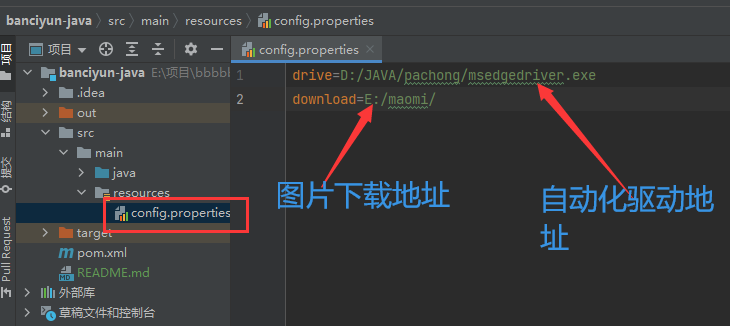
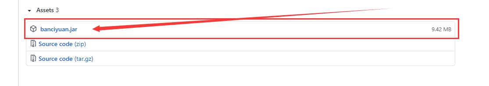

## 说明:

半次元这网站, 直接用爬虫访问好像不能拿到图片地址. 所以用的 Selenium (web自动化工具)
图片访问下载部分是直接调用的系统浏览器. 所以使用时会自动弹网页(这个好像可以静默运行, 但网上没找到静默的代码)

## 这个自动化工具需要下载驱动:

(这项目默认用的是win的Edge浏览器驱动)
(每个浏览器驱动文件不同, 甚至要和浏览器的版本相同,不然一定会报错)

## 驱动下载地址:

[Chromium/Chrome](https://chromedriver.storage.googleapis.com/index.html)

[火狐](https://github.com/mozilla/geckodriver/releases)

[Edge](https://developer.microsoft.com/en-us/microsoft-edge/tools/webdriver/)

[Internet Explorer](https://selenium-release.storage.googleapis.com/index.html)

Safari (这个好像是内置的)

[Opera](https://github.com/operasoftware/operachromiumdriver/releases)

## IDEA的文件配置:

如果是下载项目在IDEA运行, 需要配置下面这个
(路径最好不要有中文, 否则读取是可能会乱码)

然后直接右键运行就行

(顺便说下这个项目运行时好像有个未知BUG, 要运行两次才能成功. 第一次自动化工具部分代码好像不运行.
但打包后的jar文件好像没这个问题)

## 打包版好的jar包配置:
[点击下载打包好的jar包](https://github.com/Q-V-O/banciyan/releases/tag/mao)

用解压文件打开(打开就行,别解压文件啊), 在里面会看到一个 config.properties 文件. 
用文本编辑器打开就行 (如:win的记事本)
然后配置文件的修改方法上面有一样的

然后在文件夹打开cmd, 输入 java -jar banciyuan.jar  就行
(当然前提你电脑得有java环境)

